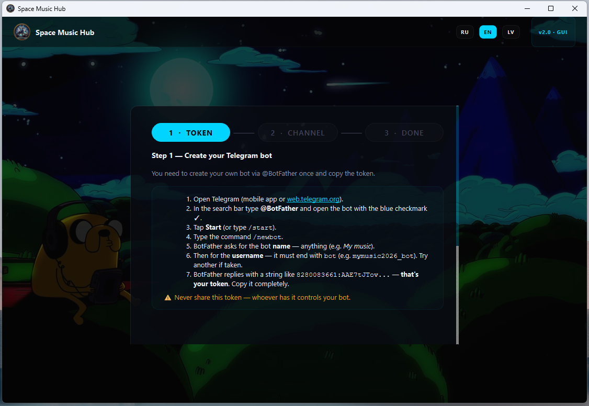
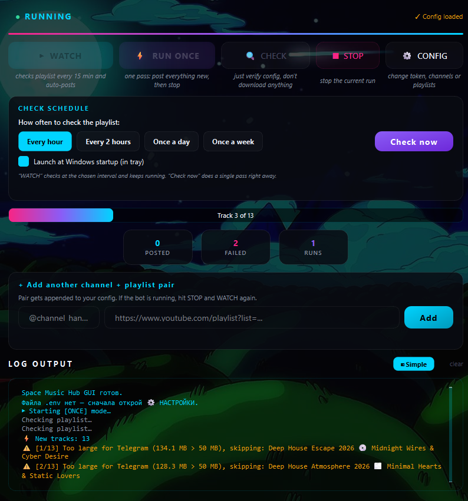
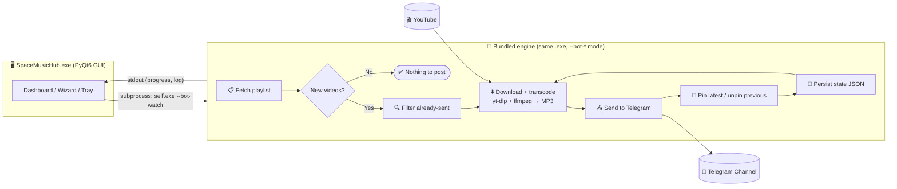

# 🚀 Space Music Hub

> 🧬 **From a Python script to a desktop app** — what began as a command-line `v1-classic` bot grew into a one-click Windows `.exe` with a neon GUI, the same proven engine inside.

[](https://github.com/AAvlasins-dev/Music-from-Youtube-playlist-to-telegram/actions/workflows/ci.yml)


[](https://aavlasins-dev.github.io/Music-from-Youtube-playlist-to-telegram/)
[](https://github.com/AAvlasins-dev/Music-from-Youtube-playlist-to-telegram/releases)


---

## 🧬 Two editions of this project

This repository shows the project's evolution from a simple script to a full desktop app:

| Branch | Edition | What it is |
|---|---|---|
| [`v1-classic`](https://github.com/AAvlasins-dev/Music-from-Youtube-playlist-to-telegram/tree/v1-classic) | **Classic** | The original Python script bot — `yt-dlp` + Telegram, run from the command line. Clean code, tests, CI, Docker. |
| [`master`](https://github.com/AAvlasins-dev/Music-from-Youtube-playlist-to-telegram) | **Desktop app** (this one) | The evolution — a polished **PyQt6 desktop app** (one Windows `.exe` + installer). Neon dashboard, a graphical 3-step setup wizard, background system-tray mode, a check scheduler, live progress, and a trilingual UI. No Python, no config files. |

> The `master` edition grew out of `v1-classic`: the **same engine lineage** — the bot is bundled and driven by the GUI, and was hardened in 2.0.0 (192 kbps pipeline, token-safe logs) — wrapped into a product anyone can install and use.

---

## 🌐 Select Language · Выберите язык · Izvēlieties valodu

[English](#english) · [Русский](#русский) · [Latviešu](#latviešu)

---

<a id="english"></a>

## English

A **desktop app for Windows** that watches YouTube playlists, downloads every new track as a 192 kbps MP3 via **yt-dlp + ffmpeg**, and posts it straight to your Telegram channel — with the original YouTube link in the caption and the latest track auto-pinned. Install the `.exe`, follow a 3-step graphical wizard, and leave it running in the system tray.

> 🟢 **Live in production** — currently mirroring 1 000+ tracks to [@music_ebat_2026](https://t.me/music_ebat_2026) and [@baiba_music](https://t.me/baiba_music).

🌐 **See it in action:** [live presentation site](https://aavlasins-dev.github.io/Music-from-Youtube-playlist-to-telegram/) · ⬇️ **Get it:** [Releases](https://github.com/AAvlasins-dev/Music-from-Youtube-playlist-to-telegram/releases)

<p align="center">
  
  
</p>

<p align="center"><sub>The 3-step setup wizard (left) and the live dashboard (right).</sub></p>

### ✨ Features

**🖥️ Desktop app (PyQt6)**

| Feature | Description |
|---|---|
| 🧙 Graphical setup wizard | 3 steps — paste bot token, add channel + playlist, review & save. Each channel can be **tested live** (the bot posts and deletes a probe message) before you commit. Detailed step-by-step instructions built in. |
| 📊 Live dashboard | Watch / Run once / Check / Stop, a **progress bar** ("track 5 of 55"), live counters (posted / failed / runs), and a **colour-coded log** with a Simple/Expert toggle |
| ⏰ Check scheduler | Choose how often to re-check: every hour / 2 hours / daily / weekly, plus a one-click **launch-at-Windows-startup** toggle |
| 🔔 System-tray background mode | Closing the window hides to the tray; the bot keeps running and can auto-start hidden on boot |
| ➕ Add pairs on the fly | Add another channel + playlist right from the dashboard — no need to re-run the wizard |
| 🌍 Trilingual UI | English / Русский / Latviešu, switchable live; defaults to English on first launch |
| 📦 One-file installer | Inno Setup `.exe` — per-user install, Desktop + Start-Menu shortcuts, clean uninstall. No Python on the target PC |

**🤖 Engine (bundled bot)**

| Feature | Description |
|---|---|
| 🎵 MP3 download & send | Downloads audio via `yt-dlp` + `ffmpeg`, sends as a real 192 kbps MP3 |
| ⚡ Download pipeline | The next track downloads while the current one uploads — ~30–40 % faster on large batches, at no extra CPU cost |
| 🪫 Background-friendly | Runs at below-normal process priority so the PC stays responsive while it works |
| ♾️ Unlimited channels | One token → many `channel ↔ playlist` pairs |
| 🔒 Single-instance lock | `bot.lock` prevents two runs colliding and duplicating posts |
| 🔧 ffmpeg auto-discovery | Finds `ffmpeg` on PATH, beside the app, or via `ffmpeg-downloader` |
| 🔗 / 📌 Link + auto-pin | Each post links back to YouTube; the latest track is auto-pinned (previous unpinned) |
| 💾 State persistence | Posted videos tracked in JSON — never re-posts the same track; oversize (>50 MB) tracks are skipped, not retried forever |
| 🔁 Retry logic | Retries failed downloads and Telegram API calls with automatic back-off (configurable attempts + delay) |
| 🔒 Token-safe logs | The bot token is masked in logs and never leaks into the UI or `bot.log` |
| 📋 Structured logging | Console + rotating `bot.log` (5 MB × 3 backups) |
| 🐳 Docker-ready | The engine also ships with `Dockerfile` + `docker-compose.yml` for headless use |

### 🏗 Architecture

**Desktop app ↔ engine.** The shipped `.exe` is the PyQt6 GUI. When you press *Watch* / *Run once* / *Check*, the GUI doesn't import the bot in-process — it **re-launches its own executable** with a `--bot-watch` / `--bot-once` / `--bot-check` flag. A dispatch guard at the top of `gui_app.py` sees the flag and runs the bundled engine instead of showing a window, streaming its stdout back into the dashboard log. One binary, two roles — no separate Python interpreter needed in the bundle, and a bot crash can never take the UI down with it.


### ⚠️ GitHub Actions limitation

GitHub Actions runners use **Microsoft Azure IP addresses**, which YouTube identifies as datacenter traffic and blocks with a `Sign in to confirm you're not a bot` error. This means `yt-dlp` **cannot download audio** when the bot runs inside GitHub Actions.

| What works on GitHub Actions | What does NOT work |
|---|---|
| ✅ Lint + unit tests (`ci.yml`) | ❌ Downloading audio from YouTube |
| ✅ Manual run (`workflow_dispatch`) | ❌ Sending MP3 files to Telegram |

**Recommended deployment for full functionality:** run the bot on any machine with a residential or non-datacenter IP — your own PC (Windows Task Scheduler / cron), a home server, or a VPS not hosted on Azure/AWS/GCP. The Docker and local Python options below work out of the box.

> This is a known limitation of all cloud CI providers when scraping YouTube. See [yt-dlp FAQ](https://github.com/yt-dlp/yt-dlp/wiki/FAQ#how-do-i-pass-cookies-to-yt-dlp) for cookie-based workarounds if you specifically need CI-based execution.

---

### 🚀 Quick Start

#### Option 0 — Ready-made Windows desktop app (no Python, no config files) ⭐

Download **`SpaceMusicHub-Setup-v2.0.0.exe`** from the [**Releases**](https://github.com/AAvlasins-dev/Music-from-Youtube-playlist-to-telegram/releases) page and run it. The installer puts the app in `%LOCALAPPDATA%\Programs`, creates shortcuts, and optionally registers launch-at-startup. On first launch a **graphical 3-step wizard** walks you through it:

```text
[1] Bot token   ->  create a bot via @BotFather, paste the token   (built-in instructions)
[2] Channel     ->  @channel + playlist URL    ·  "Test channel" posts a live probe
[3] Review      ->  save & launch the dashboard
```

From the **dashboard** you then drive everything with buttons:

| Button | What it does |
|---|---|
| ▶ **Watch** | Keep checking at the chosen interval and auto-post new tracks |
| ⚡ **Run once** | Post everything new right now, then stop |
| 🔍 **Check** | Validate config + count new tracks (no posting) |
| ⚙ **Config** | Re-open the wizard |

Pick an interval in the **schedule** panel (hourly / daily / weekly), tick **launch at Windows startup**, and the app sits in the **system tray** doing its thing — survives reboots, posts new tracks as they appear, no external scheduler needed.

📖 **Full step-by-step guide (RU):** [INSTALL.md](INSTALL.md)

<a id="-build-from-source"></a>
**Build the desktop app from source:**
```cmd
pip install -r requirements-dev.txt
pyinstaller --noconfirm SpaceMusicHubGUI.spec      :: -> dist\SpaceMusicHub\SpaceMusicHub.exe
iscc installer\SpaceMusicHub.iss                   :: -> dist\SpaceMusicHub-Setup-vX.Y.Z.exe (needs Inno Setup 6)
```

> The same bundled engine runs headless too (`SpaceMusicHub.exe --bot-watch`), and the classic script (`python telegram_bot_music_youtube.py`) still works — see the options below.

#### Option 1 — Local Python + Windows Task Scheduler

```bash
git clone https://github.com/AAvlasins-dev/Music-from-Youtube-playlist-to-telegram.git
cd Music-from-Youtube-playlist-to-telegram
python -m venv .venv && .venv\Scripts\activate
pip install -r requirements.txt
cp .env.example .env   # fill in your credentials
python telegram_bot_music_youtube.py
```

To run automatically on Windows, create a scheduled task:
```powershell
$action  = New-ScheduledTaskAction -Execute "python" `
           -Argument "telegram_bot_music_youtube.py" `
           -WorkingDirectory (Get-Location)
$trigger = New-ScheduledTaskTrigger -Daily -At "10:00"
Register-ScheduledTask -TaskName "SpaceMusicHubBot" -Action $action -Trigger $trigger
```

#### Option 2 — Docker

```bash
git clone https://github.com/AAvlasins-dev/Music-from-Youtube-playlist-to-telegram.git
cd Music-from-Youtube-playlist-to-telegram
cp .env.example .env   # fill in your credentials
docker compose up --build
```

#### Option 3 — Local Python

```bash
git clone https://github.com/AAvlasins-dev/Music-from-Youtube-playlist-to-telegram.git
cd Music-from-Youtube-playlist-to-telegram
python -m venv .venv && source .venv/bin/activate  # Windows: .venv\Scripts\activate
pip install -r requirements.txt
cp .env.example .env   # fill in your credentials
python telegram_bot_music_youtube.py
```

### ⚙️ Configuration

Copy `.env.example` to `.env` and fill in the values:

| Variable | Required | Description |
|---|---|---|
| `TELEGRAM_BOT_TOKEN` | ✅ | Bot token from [@BotFather](https://t.me/BotFather) |
| `CHANNEL_1_TELEGRAM` | ✅ | Telegram channel username **without** `@` (e.g. `my_channel`) |
| `CHANNEL_1_PLAYLIST` | ✅ | YouTube playlist ID (or full URL) for that channel |
| `CHANNEL_1_NAME` | ➖ | Label used for the state-file names / logs |
| `CHANNEL_2_*`, `CHANNEL_3_*`, … | ➖ | Add as many `channel ↔ playlist` pairs as you like (no code changes) |
| `ADMIN_CHAT_ID` | ➖ | Your Telegram chat ID — receive a run summary after each execution |
| `YOUTUBE_COOKIES_FILE` | ➖ | Path to Netscape cookies file — bypasses YouTube bot-detection on CI |
| `RETRY_ATTEMPTS` | ➖ | Retry attempts on API errors (default: `3`) |
| `RETRY_DELAY` | ➖ | Base delay in seconds between retries (default: `5`) |
| `POST_DELAY` | ➖ | Delay between consecutive posts in seconds (default: `2`) |
| `LOG_LEVEL` | ➖ | `DEBUG`, `INFO`, `WARNING`, `ERROR` (default: `INFO`) |
| `LOG_FILE` | ➖ | Path to log file (default: `bot.log`) |
| `DOWNLOAD_DIR` | ➖ | Temporary MP3 directory (default: `downloads`) |

> **GitHub Actions:** add the required secrets under **Settings → Secrets and variables → Actions**. Optionally add `YOUTUBE_COOKIES_B64` (base64-encoded cookies file) and `ADMIN_CHAT_ID`.

**Getting a YouTube Playlist ID** — it's the `list=` parameter in the playlist URL:
```
https://www.youtube.com/playlist?list=PLxxxxxxxxxxxxxxxx
                                       ^^^^^^^^^^^^^^^^
```

**Bot permissions** — add the bot as **Administrator** with: ✅ Post messages · ✅ Pin messages

### 📁 Project Structure

```
space-music-hub/
├── gui_app.py                      # PyQt6 desktop app (wizard, dashboard, tray, scheduler)
├── telegram_bot_music_youtube.py   # the engine: playlist → MP3 → Telegram
├── SpaceMusicHubGUI.spec           # PyInstaller build spec (GUI + engine + assets)
├── installer/
│   ├── SpaceMusicHub.iss           # Inno Setup script → the Windows installer
│   └── Latvian.isl                 # Latvian translation for the installer UI
├── docs/                           # GitHub Pages site + logo / bg assets
├── INSTALL.md                      # Windows install guide (RU)
├── requirements.txt                # runtime deps (incl. PyQt6)
├── requirements-dev.txt            # + pytest, ruff, pyinstaller
├── Dockerfile, docker-compose.yml  # headless-engine deployment
├── .env.example                    # environment-variable template
├── pyproject.toml                  # ruff + pytest config
├── LICENSE                         # MIT
├── CHANGELOG.md                    # version history
├── .github/workflows/
│   ├── bot.yml                     # headless engine runner (manual dispatch)
│   └── ci.yml                      # ruff + pytest on Linux & Windows, push & PR
└── tests/
    ├── test_bot.py                 # engine unit tests
    └── test_gui.py                 # GUI-layer unit tests (101 total)
```

### 🧪 Testing

```bash
pip install -r requirements-dev.txt
ruff check .                       # lint
pytest -q                          # 101 unit tests
```

**101 unit tests** (pytest), green in [CI](.github/workflows/ci.yml) on Linux **and** Windows for every push & PR, plus `ruff` linting:

| Area | What's covered |
|---|---|
| Engine | playlist-ID / channel-handle parsing, `.env` round-trip, new-video filtering, `ChannelConfig` / `RunResult`, sync + async retry, config validation, ffmpeg discovery, audio-download guards |
| Posting loop | posts in order through the download pipeline, skips already-sent, counts failures, **oversize tracks skipped not retried**, auto-pin rotation, temp-file cleanup, **HTML-escaped captions**, token-masking log filter (incl. the lazy `%`-args path) |
| GUI layer | input normalisers, `.env` read/set helpers, the log-line parser regexes that drive the live counters + progress bar, English-first language detection, the **self-dispatcher** that maps `--bot-*` flags to engine entry points |

Network and Telegram calls are mocked — the suite is deterministic, hermetic and runs in ~1 s. The GUI tests touch no `QApplication`, so they run headless in CI (with `QT_QPA_PLATFORM=offscreen`).

### 📦 Dependencies

| Package | Version | Purpose |
|---|---|---|
| `PyQt6` | ≥ 6.7 | Desktop GUI (dashboard, wizard, tray, scheduler) |
| `python-telegram-bot` | 21.6 | Telegram Bot API client |
| `yt-dlp` | latest | YouTube playlist extraction + audio download |
| `python-dotenv` | 1.0.1 | Load environment variables from `.env` |
| `ffmpeg-downloader` | ≥ 0.3 | Auto-downloads a portable `ffmpeg` binary if not on PATH |

> Packaged with **PyInstaller** (one-folder bundle) + **Inno Setup 6** (installer). Dev tooling: **pytest** + **ruff**.
> **ffmpeg** is detected automatically: PATH → `ffmpeg-downloader` bundle → explicit `FFMPEG_PATH` env var. In Docker it is installed by the `Dockerfile`. On Windows, install via `pip install ffmpeg-downloader && python -m ffmpeg_downloader install`.

### 📝 License

MIT — feel free to use and modify.

### ⚖️ Disclaimer

This is an **educational portfolio project**. The software is a tool and ships no
copyrighted content. You are responsible for how you use it — use only content you
have the rights to (your own uploads, Creative-Commons / royalty-free music, or
private channels). Full text: [DISCLAIMER.md](DISCLAIMER.md).

---

<a id="русский"></a>

## Русский

**Десктоп-приложение для Windows**: следит за YouTube-плейлистами, скачивает каждый новый трек как MP3 192 kbps через **yt-dlp + ffmpeg** и отправляет прямо в Telegram-канал — со ссылкой на YouTube в подписи и автозакреплением последнего трека. Ставишь `.exe`, проходишь графический мастер из 3 шагов, и оно работает в фоне в системном трее.

> 🟢 **Работает в продакшне** — прямо сейчас зеркалирует 1 000+ треков в [@music_ebat_2026](https://t.me/music_ebat_2026) и [@baiba_music](https://t.me/baiba_music).

> 🖥️ **PyQt6-приложение:** неоновый дашборд, мастер настройки с пошаговыми инструкциями и кнопкой «Тест канала», фоновый режим в трее, планировщик проверок (час / день / неделя), автозапуск с Windows, прогресс-бар, конвейерная загрузка, и интерфейс на 3 языках (EN / RU / LV). Один установщик `.exe`, Python на целевом ПК не нужен. Движок — это проверенный бот из ветки `v1-classic`, встроенный в приложение.

### ✨ Возможности

**🖥️ Десктоп-приложение (PyQt6)**

| Функция | Описание |
|---|---|
| 🧙 Графический мастер настройки | 3 шага — вставить токен, добавить канал + плейлист, проверить и сохранить. Каждый канал можно **протестировать вживую** (бот публикует и удаляет проверочное сообщение). Пошаговые инструкции встроены. |
| 📊 Живой дашборд | Watch / Run once / Check / Stop, **прогресс-бар** («трек 5 из 55»), счётчики (опубликовано / ошибки / запуски) и **цветной лог** с переключателем Simple/Expert |
| ⏰ Планировщик проверок | Как часто перепроверять: каждый час / 2 часа / день / неделю, плюс галочка **автозапуска с Windows** |
| 🔔 Фоновый режим в трее | При закрытии окно прячется в трей; бот продолжает работать и может стартовать скрытым при загрузке |
| ➕ Добавление пар на лету | Ещё канал + плейлист прямо с дашборда — без повторного мастера |
| 🌍 Интерфейс на 3 языках | English / Русский / Latviešu, переключается вживую; по умолчанию English |
| 📦 Установщик одним файлом | Inno Setup `.exe` — установка для пользователя, ярлыки, чистое удаление. Python на целевом ПК не нужен |

**🤖 Движок (встроенный бот)**

| Функция | Описание |
|---|---|
| 🎵 Скачивание и отправка MP3 | Скачивает аудио через `yt-dlp` + `ffmpeg`, отправляет как настоящий MP3 192 kbps |
| ⚡ Конвейер загрузки | Следующий трек качается, пока текущий загружается — на больших партиях ~30–40 % быстрее |
| 🪫 Дружелюбен к фону | Работает с пониженным приоритетом — ПК остаётся отзывчивым |
| ♾️ Сколько угодно каналов | Один токен → много пар `канал ↔ плейлист` |
| 🔒 Single-instance lock | `bot.lock` не даёт двум запускам столкнуться и задвоить посты |
| 🔧 Авто-поиск ffmpeg | Находит `ffmpeg` в PATH, рядом с приложением или через `ffmpeg-downloader` |
| 🔗 / 📌 Ссылка + автозакрепление | Каждый пост ссылается на YouTube; последний трек автозакрепляется |
| 💾 Сохранение состояния | Опубликованные видео в JSON — трек не постится повторно; >50 МБ пропускаются, не зависая в ретраях |
| 🔁 Retry-логика | Повторяет неудачные загрузки и вызовы API с автоматической задержкой между попытками |
| 🔒 Токен-безопасные логи | Токен маскируется в логах и не попадает в UI или `bot.log` |
| 📋 Структурированные логи | Консоль + ротируемый `bot.log` (5 МБ × 3 копии) |
| 🐳 Docker для движка | `Dockerfile` + `docker-compose.yml` для headless-запуска на сервере |

### 🏗 Архитектура

**Приложение ↔ движок.** Собранный `.exe` — это PyQt6 GUI. При нажатии *Watch* / *Run once* / *Check* GUI **перезапускает сам себя** с флагом `--bot-watch` / `--bot-once` / `--bot-check`. Диспетчер в начале `gui_app.py` видит флаг и запускает встроенный движок вместо окна, стримя его stdout в лог дашборда. Один бинарь — две роли: отдельный Python не нужен, а падение бота не роняет UI.



### ⚠️ Ограничение GitHub Actions

Раннеры GitHub Actions работают на серверах **Microsoft Azure**, IP-адреса которых YouTube распознаёт как дата-центр и блокирует с ошибкой `Sign in to confirm you're not a bot`. Это значит, что `yt-dlp` **не может скачивать аудио** при запуске внутри GitHub Actions.

| Что работает в GitHub Actions | Что НЕ работает |
|---|---|
| ✅ Линтер + юнит-тесты (`ci.yml`) | ❌ Скачивание аудио с YouTube |
| ✅ Ручной запуск (`workflow_dispatch`) | ❌ Отправка MP3 в Telegram |

**Рекомендуемый способ для полного функционала:** запускай бота на любой машине с домашним или не дата-центровым IP — твой ПК (Windows Task Scheduler или cron), домашний сервер, или VPS не на Azure/AWS/GCP. Варианты Docker и локального Python ниже работают без ограничений.

> Это известное ограничение всех облачных CI-провайдеров при работе с YouTube. Подробнее — в [yt-dlp FAQ](https://github.com/yt-dlp/yt-dlp/wiki/FAQ#how-do-i-pass-cookies-to-yt-dlp).

---

### 🚀 Быстрый старт

#### Вариант 0 — Готовое приложение для Windows (без Python и конфигов) ⭐

Скачай **`SpaceMusicHub-Setup-v2.0.0.exe`** со страницы [**Releases**](https://github.com/AAvlasins-dev/Music-from-Youtube-playlist-to-telegram/releases/latest) и запусти. Установщик ставит приложение, создаёт ярлыки и по желанию регистрирует автозапуск. При первом запуске **графический мастер из 3 шагов** проведёт настройку, дальше всем управляет дашборд (Watch / Run once / Check / Config) и планировщик в трее — переживает перезагрузки, постит новые треки сам.

📖 **Подробный гайд:** [INSTALL.md](INSTALL.md)

> Тот же встроенный движок работает и headless (`SpaceMusicHub.exe --bot-watch`), а классический скрипт (`python telegram_bot_music_youtube.py`) по-прежнему работает — см. варианты ниже.

#### Вариант 1 — Локальный Python + Windows Task Scheduler

```bash
git clone https://github.com/AAvlasins-dev/Music-from-Youtube-playlist-to-telegram.git
cd Music-from-Youtube-playlist-to-telegram
python -m venv .venv && .venv\Scripts\activate
pip install -r requirements.txt
cp .env.example .env   # заполни данные
python telegram_bot_music_youtube.py
```

Для автозапуска на Windows создай задание в PowerShell:
```powershell
$action  = New-ScheduledTaskAction -Execute "python" `
           -Argument "telegram_bot_music_youtube.py" `
           -WorkingDirectory (Get-Location)
$trigger = New-ScheduledTaskTrigger -Daily -At "10:00"
Register-ScheduledTask -TaskName "SpaceMusicHubBot" -Action $action -Trigger $trigger
```

#### Вариант 2 — Docker

```bash
cp .env.example .env   # заполни данные
docker compose up --build
```

#### Вариант 3 — Локальный Python

```bash
python -m venv .venv && .venv\Scripts\activate
pip install -r requirements.txt
cp .env.example .env   # заполни данные
python telegram_bot_music_youtube.py
```

### ⚙️ Настройка

| Переменная | Обязательна | Описание |
|---|---|---|
| `TELEGRAM_BOT_TOKEN` | ✅ | Токен бота от [@BotFather](https://t.me/BotFather) |
| `CHANNEL_1_TELEGRAM` | ✅ | Username Telegram-канала **без** `@` (например `my_channel`) |
| `CHANNEL_1_PLAYLIST` | ✅ | ID плейлиста YouTube (или полная ссылка) для этого канала |
| `CHANNEL_1_NAME` | ➖ | Метка для имён state-файлов и логов |
| `CHANNEL_2_*`, `CHANNEL_3_*`, … | ➖ | Добавляй сколько угодно пар `канал ↔ плейлист` (без правки кода) |
| `ADMIN_CHAT_ID` | ➖ | Твой Telegram chat ID — получай итог после каждого запуска |
| `YOUTUBE_COOKIES_FILE` | ➖ | Путь к файлу cookies — обходит блокировку YouTube на CI |
| `RETRY_ATTEMPTS` | ➖ | Количество попыток при ошибках API (по умолчанию: `3`) |
| `RETRY_DELAY` | ➖ | Базовая задержка между попытками в секундах (по умолчанию: `5`) |
| `POST_DELAY` | ➖ | Задержка между публикациями в секундах (по умолчанию: `2`) |
| `LOG_LEVEL` | ➖ | `DEBUG`, `INFO`, `WARNING`, `ERROR` (по умолчанию: `INFO`) |
| `LOG_FILE` | ➖ | Путь к файлу лога (по умолчанию: `bot.log`) |
| `DOWNLOAD_DIR` | ➖ | Временная папка для MP3. На Windows — только ASCII-путь, напр. `C:\Temp\music_bot` |

> **Секреты GitHub Actions:** добавь обязательные переменные в **Settings → Secrets and variables → Actions**. Опционально: `YOUTUBE_COOKIES_B64` и `ADMIN_CHAT_ID`.

**ID плейлиста YouTube** — параметр `list=` в URL плейлиста:
```
https://www.youtube.com/playlist?list=PLxxxxxxxxxxxxxxxx
```

**Права бота в канале** — добавь как **Администратора**: ✅ Публикация · ✅ Закрепление

### 📦 Зависимости

| Пакет | Версия | Назначение |
|---|---|---|
| `python-telegram-bot` | 21.6 | Клиент Telegram Bot API |
| `yt-dlp` | latest | Извлечение плейлистов YouTube и скачивание аудио |
| `python-dotenv` | 1.0.1 | Загрузка переменных окружения из `.env` |
| `ffmpeg-downloader` | ≥ 0.3 | Автоматически скачивает портативный бинарник `ffmpeg` |

> **ffmpeg** определяется автоматически: PATH → пакет `ffmpeg-downloader` → явная переменная `FFMPEG_PATH`. В Docker устанавливается в `Dockerfile`. На Windows: `pip install ffmpeg-downloader && python -m ffmpeg_downloader install`.

### 📝 Лицензия

MIT — используй и модифицируй свободно.

### ⚖️ Правовая оговорка

Это **образовательный проект для портфолио**. Программа — это инструмент, она не
содержит защищённого контента. Ответственность за использование несёт пользователь:
используй только то, на что у тебя есть права (свои загрузки, музыка Creative Commons /
royalty-free, либо приватные каналы). Полный текст: [DISCLAIMER.md](DISCLAIMER.md).

---

<a id="latviešu"></a>

## Latviešu

Seko YouTube atskaņošanas sarakstiem, lejupielādē katru jaunu dziesmu kā MP3 192 kbps ar **yt-dlp + ffmpeg** un publicē tieši Telegram kanālā — ar YouTube saiti parakstā un automātisku jaunākā ieraksta piespraušanu.

> 🟢 **Darbojas produkcijā** — pašlaik spoguļo 1 000+ dziesmas kanālos [@music_ebat_2026](https://t.me/music_ebat_2026) un [@baiba_music](https://t.me/baiba_music).

> 🖥️ **PyQt6 lietotne:** neona panelis, iestatīšanas vednis ar pogu “Test channel”, fona režīms sistēmas teknē, pārbaužu plānotājs (stundā / dienā / nedēļā), automātiska palaišana ar Windows un saskarne 3 valodās (EN / RU / LV). Viens `.exe` instalators — Python mērķa datorā nav vajadzīgs.

### ✨ Iespējas

| Funkcija | Apraksts |
|---|---|
| 🖥️ Darbvirsmas lietotne (PyQt6) | Grafisks 3 soļu vednis, dzīvs panelis (Watch / Run once / Check), pārbaužu plānotājs un fona režīms sistēmas teknē |
| 🎵 MP3 lejupielāde un sūtīšana | Lejupielādē audio ar `yt-dlp` + `ffmpeg`, sūta kā īstu MP3 192 kbps |
| 🔗 / 📌 Saite + piespraušana | Katrs ieraksts satur YouTube saiti; jaunākais tiek automātiski piesprausts |
| 💾 Stāvokļa saglabāšana | Izseko publicētos videoklipus — nekad neatkārto ierakstu |
| 🔁 Atkārtošanas loģika | Automātiska aizkave neveiksmīgām lejupielādēm un API izsaukumiem |
| 🔒 Marķiera drošība | Bota marķieris tiek maskēts žurnālos un nenoplūst saskarnē |
| 🌍 Saskarne 3 valodās | English / Русский / Latviešu, pārslēdzama dzīvi |

### ⚠️ GitHub Actions ierobežojums

GitHub Actions izmanto **Microsoft Azure** serverus, kuru IP adreses YouTube atpazīst kā datu centru un bloķē ar kļūdu `Sign in to confirm you're not a bot`. Tas nozīmē, ka `yt-dlp` **nevar lejupielādēt audio** GitHub Actions vidē.

| Darbojas GitHub Actions | NEDARBOJAS |
|---|---|
| ✅ Lint + testi (`ci.yml`) | ❌ Audio lejupielāde no YouTube |
| ✅ Manuāla palaišana (`workflow_dispatch`) | ❌ MP3 sūtīšana uz Telegram |

**Ieteicamā izvietošana pilnai funkcionalitātei:** palaid botu jebkurā mašīnā ar mājas vai ne-datu-centra IP — savs dators, mājas serveris vai VPS ārpus Azure/AWS/GCP.

---

### 🚀 Ātrā palaišana

**Variants 0 — gatava Windows lietotne (bez Python) ⭐:** lejupielādē **`SpaceMusicHub-Setup-v2.0.0.exe`** no [**Releases**](https://github.com/AAvlasins-dev/Music-from-Youtube-playlist-to-telegram/releases/latest) un palaid — grafiskais 3 soļu vednis visu iestata, pēc tam viss notiek panelī un sistēmas teknē. Sīkāk: [INSTALL.md](INSTALL.md).

**Izstrādātājiem (Python):**

```bash
git clone https://github.com/AAvlasins-dev/Music-from-Youtube-playlist-to-telegram.git
cd Music-from-Youtube-playlist-to-telegram
cp .env.example .env   # aizpildi datus
python -m venv .venv && source .venv/bin/activate
pip install -r requirements.txt
python telegram_bot_music_youtube.py
```

### ⚙️ Konfigurācija

| Mainīgais | Nepieciešams | Apraksts |
|---|---|---|
| `TELEGRAM_BOT_TOKEN` | ✅ | Bota marķieris no [@BotFather](https://t.me/BotFather) |
| `CHANNEL_1_TELEGRAM` | ✅ | Telegram kanāla lietotājvārds **bez** `@` |
| `CHANNEL_1_PLAYLIST` | ✅ | YouTube atskaņošanas saraksta ID (vai pilna saite) |
| `CHANNEL_1_NAME` | ➖ | Etiķete stāvokļa failu nosaukumiem / žurnāliem |
| `CHANNEL_2_*`, `CHANNEL_3_*`, … | ➖ | Pievieno tik `kanāls ↔ saraksts` pāru, cik vēlies |
| `ADMIN_CHAT_ID` | ➖ | Tavs Telegram chat ID kopsavilkuma paziņojumiem |

### 🏗 Arhitektūra

Iebūvētais `.exe` ir GUI. Nospiežot Watch / Run once / Check, tas **pārstartē sevi** ar karogu `--bot-watch` / `--bot-once` / `--bot-check`; dispečers `gui_app.py` sākumā palaiž iebūvēto dzinēju saskarnes vietā un straumē izvadi atpakaļ uz paneļa žurnālu. Viens binārs, divas lomas — dzinēja avārija nenogāž lietotni.


### 🧪 Testēšana

**101 vienības tests** (pytest), zaļi [CI](.github/workflows/ci.yml) uz Linux un Windows katram push un PR, plus `ruff` linteris.

```bash
pip install -r requirements-dev.txt
ruff check .
QT_QPA_PLATFORM=offscreen pytest -q       # 101 tests
```

### 📝 Licence

MIT — brīvi izmantojiet un modificējiet.
