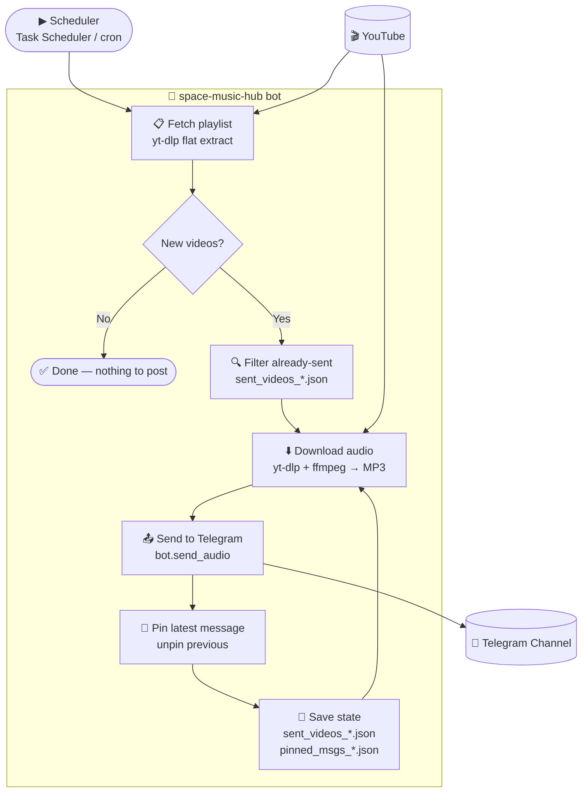

# 🚀 Space Music Hub

[](https://github.com/AAvlasins-dev/Music-from-Youtube-playlist-to-telegram/actions/workflows/bot.yml)
[](https://github.com/AAvlasins-dev/Music-from-Youtube-playlist-to-telegram/actions/workflows/ci.yml)

[](https://github.com/AAvlasins-dev/Music-from-Youtube-playlist-to-telegram/releases)


---

## 🌐 Select Language · Выберите язык · Izvēlieties valodu

[🇬🇧 English](#english) · [🇷🇺 Русский](#русский) · [🇱🇻 Latviešu](#latviešu)

---

<a id="english"></a>

## 🇬🇧 English

Watches YouTube playlists, downloads every new track as a 192 kbps MP3 via **yt-dlp + ffmpeg**, and posts it straight to your Telegram channel — with the original YouTube link in the caption and the latest track auto-pinned.

> 🟢 **Live in production** — currently mirroring 1 000+ tracks to [@music_ebat_2026](https://t.me/music_ebat_2026) and [@baiba_music](https://t.me/baiba_music).

### ✨ Features

| Feature | Description |
|---|---|
| 🧙 Interactive setup wizard | First-run wizard verifies token/channel/playlist live — zero config files |
| 📦 Standalone `.exe` | One-file Windows build — no Python required on the target PC |
| 🖥️ Menu-driven app | Run / Check / Reconfigure from a console menu; `--run` for automation |
| 🔎 `--check` dry-run | Validate config + count new tracks without posting anything |
| ♾️ Unlimited channels | Add channels in the wizard or via `CHANNEL_N_*` — no code changes |
| 🎵 MP3 download & send | Downloads audio via `yt-dlp` + `ffmpeg`, sends as a real MP3 file |
| 🔒 Single-instance lock | `bot.lock` prevents two runs colliding and duplicating posts |
| 🔧 ffmpeg auto-discovery | Finds `ffmpeg` on PATH, beside the app, or via `ffmpeg-downloader` |
| 🔗 YouTube link in caption | Each post includes the original YouTube link |
| 📌 Auto-pinning | Unpins the previous post, pins the latest one automatically |
| 💾 State persistence | Tracks posted videos in JSON files — never re-posts the same track |
| 🔁 Retry logic | Retries failed downloads and Telegram API calls with exponential back-off |
| 📋 Structured logging | Logs to console and a rotating `bot.log` file (5 MB × 3 backups) |
| 🔔 Admin notifications | Optional summary message to your own Telegram on each run |
| 🐳 Docker-ready | Ships with `Dockerfile` and `docker-compose.yml` |
| ⚙️ Fully configurable | All behaviour controlled via environment variables |
| 🪟 Windows-friendly | Handles non-ASCII paths; `run_bot.bat` for Task Scheduler |

### 🏗 Architecture



### ⚠️ GitHub Actions limitation

GitHub Actions runners use **Microsoft Azure IP addresses**, which YouTube identifies as datacenter traffic and blocks with a `Sign in to confirm you're not a bot` error. This means `yt-dlp` **cannot download audio** when the bot runs inside GitHub Actions.

| What works on GitHub Actions | What does NOT work |
|---|---|
| ✅ Lint + unit tests (`ci.yml`) | ❌ Downloading audio from YouTube |
| ✅ Scheduled trigger / workflow_dispatch | ❌ Sending MP3 files to Telegram |
| ✅ Committing state files back to the repo | |

**Recommended deployment for full functionality:** run the bot on any machine with a residential or non-datacenter IP — your own PC (Windows Task Scheduler / cron), a home server, or a VPS not hosted on Azure/AWS/GCP. The Docker and local Python options below work out of the box.

> This is a known limitation of all cloud CI providers when scraping YouTube. See [yt-dlp FAQ](https://github.com/yt-dlp/yt-dlp/wiki/FAQ#how-do-i-pass-cookies-to-yt-dlp) for cookie-based workarounds if you specifically need CI-based execution.

---

### 🚀 Quick Start

#### Option 0 — Ready-made Windows app (no Python, no config files) ⭐

Download the ZIP from the [**Releases**](https://github.com/AAvlasins-dev/Music-from-Youtube-playlist-to-telegram/releases) page, unzip, and **double-click `SpaceMusicHub.exe`**. On first launch an **interactive setup wizard** asks for your bot token, channel and playlist — verifies each one live — and writes the config for you. No manual `.env` editing.

```text
[1/3] Telegram bot token   ->  paste token   (verified instantly)
[2/3] Channels             ->  paste @channel + playlist URL
[3/3] Saving configuration ->  done — Run now? (Y/n)
```

After setup, every launch shows a simple menu:

```text
  1) Run now      - download & post new tracks
  2) Check        - verify config, count new tracks (no posting)
  3) Reconfigure  - run the setup wizard again
  4) Exit
```

CLI flags for automation: `--run` (headless, for Task Scheduler) · `--check` · `--setup`

📖 **Full step-by-step guide (RU):** [INSTALL.md](INSTALL.md)

Build it yourself from source:
```cmd
pip install -r requirements.txt pyinstaller
build_exe.bat                 # → dist\SpaceMusicHub.exe
```

#### Option 1 — Local Python + Windows Task Scheduler

```bash
git clone https://github.com/AAvlasins-dev/Music-from-Youtube-playlist-to-telegram.git
cd Music-from-Youtube-playlist-to-telegram
python -m venv .venv && .venv\Scripts\activate
pip install -r requirements.txt
cp .env.example .env   # fill in your credentials
python telegram_bot_music_youtube.py
```

To run automatically on Windows, create a scheduled task:
```powershell
$action  = New-ScheduledTaskAction -Execute "python" `
           -Argument "telegram_bot_music_youtube.py" `
           -WorkingDirectory (Get-Location)
$trigger = New-ScheduledTaskTrigger -Daily -At "10:00"
Register-ScheduledTask -TaskName "SpaceMusicHubBot" -Action $action -Trigger $trigger
```

#### Option 2 — Docker

```bash
git clone https://github.com/AAvlasins-dev/Music-from-Youtube-playlist-to-telegram.git
cd Music-from-Youtube-playlist-to-telegram
cp .env.example .env   # fill in your credentials
docker compose up --build
```

#### Option 3 — Local Python

```bash
git clone https://github.com/AAvlasins-dev/Music-from-Youtube-playlist-to-telegram.git
cd Music-from-Youtube-playlist-to-telegram
python -m venv .venv && source .venv/bin/activate  # Windows: .venv\Scripts\activate
pip install -r requirements.txt
cp .env.example .env   # fill in your credentials
python telegram_bot_music_youtube.py
```

### ⚙️ Configuration

Copy `.env.example` to `.env` and fill in the values:

| Variable | Required | Description |
|---|---|---|
| `TELEGRAM_BOT_TOKEN` | ✅ | Bot token from [@BotFather](https://t.me/BotFather) |
| `PLAYLIST_ANDREY` | ✅ | YouTube playlist ID for Andrey's channel |
| `TELEGRAM_CHANNEL_ANDREY` | ✅ | Telegram channel username **without** `@` (e.g. `my_channel`) |
| `PLAYLIST_BAYBA` | ✅ | YouTube playlist ID for Bayba's channel |
| `TELEGRAM_CHANNEL_BAYBA` | ✅ | Telegram channel username **without** `@` |
| `ADMIN_CHAT_ID` | ➖ | Your Telegram chat ID — receive a run summary after each execution |
| `YOUTUBE_COOKIES_FILE` | ➖ | Path to Netscape cookies file — bypasses YouTube bot-detection on CI |
| `RETRY_ATTEMPTS` | ➖ | Retry attempts on API errors (default: `3`) |
| `RETRY_DELAY` | ➖ | Base delay in seconds between retries (default: `5`) |
| `POST_DELAY` | ➖ | Delay between consecutive posts in seconds (default: `2`) |
| `LOG_LEVEL` | ➖ | `DEBUG`, `INFO`, `WARNING`, `ERROR` (default: `INFO`) |
| `LOG_FILE` | ➖ | Path to log file (default: `bot.log`) |
| `DOWNLOAD_DIR` | ➖ | Temporary MP3 directory (default: `downloads`) |

> **GitHub Actions:** add the required secrets under **Settings → Secrets and variables → Actions**. Optionally add `YOUTUBE_COOKIES_B64` (base64-encoded cookies file) and `ADMIN_CHAT_ID`.

**Getting a YouTube Playlist ID** — it's the `list=` parameter in the playlist URL:
```
https://www.youtube.com/playlist?list=PLxxxxxxxxxxxxxxxx
                                       ^^^^^^^^^^^^^^^^
```

**Bot permissions** — add the bot as **Administrator** with: ✅ Post messages · ✅ Pin messages

### 📁 Project Structure

```
space-music-hub/
├── telegram_bot_music_youtube.py   # Main bot script
├── build_exe.bat                   # Builds dist\SpaceMusicHub.exe (PyInstaller)
├── INSTALL.md                      # Detailed Windows install guide (RU)
├── requirements.txt                # Python dependencies
├── Dockerfile                      # Docker image definition
├── docker-compose.yml              # Docker Compose config
├── .env.example                    # Environment variables template
├── .gitignore                      # Git ignore rules
├── CHANGELOG.md                    # Version history
├── .github/
│   └── workflows/
│       ├── bot.yml                 # Scheduled bot runner (daily)
│       └── ci.yml                  # Lint + tests on every push
└── tests/
    └── test_bot.py                 # 46 unit tests (pytest)
```

### 📦 Dependencies

| Package | Version | Purpose |
|---|---|---|
| `python-telegram-bot` | 21.6 | Telegram Bot API client |
| `yt-dlp` | ≥ 2026.3 | YouTube playlist extraction + audio download |
| `python-dotenv` | 1.0.1 | Load environment variables from `.env` |
| `ffmpeg-downloader` | ≥ 1.1 | Auto-downloads a portable `ffmpeg` binary if not on PATH |

> **ffmpeg** is detected automatically: PATH → `ffmpeg-downloader` bundle → explicit `FFMPEG_PATH` env var. In Docker it is installed by the `Dockerfile`. On Windows, install via `pip install ffmpeg-downloader && python -m ffmpeg_downloader install`.

### 📝 License

MIT — feel free to use and modify.

---

<a id="русский"></a>

## 🇷🇺 Русский

Следит за YouTube-плейлистами, скачивает каждый новый трек как MP3 192 kbps через **yt-dlp + ffmpeg** и отправляет прямо в Telegram-канал — со ссылкой на YouTube в подписи и автозакреплением последнего трека.

> 🟢 **Работает в продакшне** — прямо сейчас зеркалирует 1 000+ треков в [@music_ebat_2026](https://t.me/music_ebat_2026) и [@baiba_music](https://t.me/baiba_music).

### ✨ Возможности

| Функция | Описание |
|---|---|
| 🎵 Скачивание и отправка MP3 | Скачивает аудио через `yt-dlp` + `ffmpeg`, отправляет как настоящий MP3-файл |
| 🔧 Авто-поиск ffmpeg | Находит `ffmpeg` в PATH или через `ffmpeg-downloader` — ручная настройка не нужна |
| 🔗 Ссылка на YouTube в подписи | Каждый пост содержит оригинальную ссылку на YouTube |
| 📌 Автозакрепление | Открепляет предыдущее сообщение, автоматически закрепляет новое |
| 💾 Сохранение состояния | Отслеживает опубликованные видео — никогда не постит трек повторно |
| 🔁 Retry-логика | Повторяет неудачные загрузки и вызовы API с экспоненциальной задержкой |
| 📋 Структурированные логи | Консоль + ротируемый файл `bot.log` (5 МБ × 3 копии) |
| 🔔 Уведомления администратору | Опциональное итоговое сообщение в Telegram после каждого запуска |
| 🐳 Docker-ready | `Dockerfile` + `docker-compose.yml` для развёртывания одной командой |
| ⚙️ Полная настройка | Всё поведение управляется через переменные окружения |
| 🪟 Windows-friendly | Корректно работает с кириллическими путями; `run_bot.bat` для Task Scheduler |

### ⚠️ Ограничение GitHub Actions

Раннеры GitHub Actions работают на серверах **Microsoft Azure**, IP-адреса которых YouTube распознаёт как дата-центр и блокирует с ошибкой `Sign in to confirm you're not a bot`. Это значит, что `yt-dlp` **не может скачивать аудио** при запуске внутри GitHub Actions.

| Что работает в GitHub Actions | Что НЕ работает |
|---|---|
| ✅ Линтер + юнит-тесты (`ci.yml`) | ❌ Скачивание аудио с YouTube |
| ✅ Запуск по расписанию / вручную | ❌ Отправка MP3 в Telegram |
| ✅ Коммит state-файлов обратно в репо | |

**Рекомендуемый способ для полного функционала:** запускай бота на любой машине с домашним или не дата-центровым IP — твой ПК (Windows Task Scheduler или cron), домашний сервер, или VPS не на Azure/AWS/GCP. Варианты Docker и локального Python ниже работают без ограничений.

> Это известное ограничение всех облачных CI-провайдеров при работе с YouTube. Подробнее — в [yt-dlp FAQ](https://github.com/yt-dlp/yt-dlp/wiki/FAQ#how-do-i-pass-cookies-to-yt-dlp).

---

### 🚀 Быстрый старт

#### Вариант 1 — Локальный Python + Windows Task Scheduler (рекомендуется)

```bash
git clone https://github.com/AAvlasins-dev/Music-from-Youtube-playlist-to-telegram.git
cd Music-from-Youtube-playlist-to-telegram
python -m venv .venv && .venv\Scripts\activate
pip install -r requirements.txt
cp .env.example .env   # заполни данные
python telegram_bot_music_youtube.py
```

Для автозапуска на Windows создай задание в PowerShell:
```powershell
$action  = New-ScheduledTaskAction -Execute "python" `
           -Argument "telegram_bot_music_youtube.py" `
           -WorkingDirectory (Get-Location)
$trigger = New-ScheduledTaskTrigger -Daily -At "10:00"
Register-ScheduledTask -TaskName "SpaceMusicHubBot" -Action $action -Trigger $trigger
```

#### Вариант 2 — Docker

```bash
cp .env.example .env   # заполни данные
docker compose up --build
```

#### Вариант 3 — Локальный Python

```bash
python -m venv .venv && .venv\Scripts\activate
pip install -r requirements.txt
cp .env.example .env   # заполни данные
python telegram_bot_music_youtube.py
```

### ⚙️ Настройка

| Переменная | Обязательна | Описание |
|---|---|---|
| `TELEGRAM_BOT_TOKEN` | ✅ | Токен бота от [@BotFather](https://t.me/BotFather) |
| `PLAYLIST_ANDREY` | ✅ | ID плейлиста YouTube для канала Андрея |
| `TELEGRAM_CHANNEL_ANDREY` | ✅ | Username Telegram-канала **без** `@` (например `my_channel`) |
| `PLAYLIST_BAYBA` | ✅ | ID плейлиста YouTube для канала Байбы |
| `TELEGRAM_CHANNEL_BAYBA` | ✅ | Username Telegram-канала **без** `@` |
| `ADMIN_CHAT_ID` | ➖ | Твой Telegram chat ID — получай итог после каждого запуска |
| `YOUTUBE_COOKIES_FILE` | ➖ | Путь к файлу cookies — обходит блокировку YouTube на CI |
| `RETRY_ATTEMPTS` | ➖ | Количество попыток при ошибках API (по умолчанию: `3`) |
| `RETRY_DELAY` | ➖ | Базовая задержка между попытками в секундах (по умолчанию: `5`) |
| `POST_DELAY` | ➖ | Задержка между публикациями в секундах (по умолчанию: `2`) |
| `LOG_LEVEL` | ➖ | `DEBUG`, `INFO`, `WARNING`, `ERROR` (по умолчанию: `INFO`) |

> **Секреты GitHub Actions:** добавь обязательные переменные в **Settings → Secrets and variables → Actions**. Опционально: `YOUTUBE_COOKIES_B64` и `ADMIN_CHAT_ID`.

**ID плейлиста YouTube** — параметр `list=` в URL плейлиста:
```
https://www.youtube.com/playlist?list=PLxxxxxxxxxxxxxxxx
```

**Права бота в канале** — добавь как **Администратора**: ✅ Публикация · ✅ Закрепление

### 📦 Зависимости

| Пакет | Версия | Назначение |
|---|---|---|
| `python-telegram-bot` | 21.6 | Клиент Telegram Bot API |
| `yt-dlp` | ≥ 2026.3 | Извлечение плейлистов YouTube и скачивание аудио |
| `python-dotenv` | 1.0.1 | Загрузка переменных окружения из `.env` |
| `ffmpeg-downloader` | ≥ 1.1 | Автоматически скачивает портативный бинарник `ffmpeg` |

> **ffmpeg** определяется автоматически: PATH → пакет `ffmpeg-downloader` → явная переменная `FFMPEG_PATH`. В Docker устанавливается в `Dockerfile`. На Windows: `pip install ffmpeg-downloader && python -m ffmpeg_downloader install`.

### 📝 Лицензия

MIT — используй и модифицируй свободно.

---

<a id="latviešu"></a>

## 🇱🇻 Latviešu

Seko YouTube atskaņošanas sarakstiem, lejupielādē katru jaunu dziesmu kā MP3 192 kbps ar **yt-dlp + ffmpeg** un publicē tieši Telegram kanālā — ar YouTube saiti parakstā un automātisku jaunākā ieraksta piespraušanu.

> 🟢 **Darbojas produkcijā** — pašlaik spoguļo 1 000+ dziesmas kanālos [@music_ebat_2026](https://t.me/music_ebat_2026) un [@baiba_music](https://t.me/baiba_music).

### ✨ Iespējas

| Funkcija | Apraksts |
|---|---|
| 🎵 MP3 lejupielāde un sūtīšana | Lejupielādē audio ar `yt-dlp` + `ffmpeg`, sūta kā īstu MP3 |
| 🔗 YouTube saite parakstā | Katrs ieraksts satur oriģinālo YouTube saiti |
| 📌 Automātiska piespraušana | Atsprauž iepriekšējo, piesprauž jaunāko ziņojumu |
| 💾 Stāvokļa saglabāšana | Izseko publicētos videoklipus — nekad neatkārto ierakstu |
| 🔁 Atkārtošanas loģika | Eksponenciāla aizkave neveiksmīgiem izsaukumiem |
| 🔔 Administratora paziņojumi | Kopsavilkuma ziņojums Telegram pēc katras izpildes |
| ☁️ Bezmaksas hostings | GitHub Actions grafiks — nulles infrastruktūras izmaksas |

### ⚠️ GitHub Actions ierobežojums

GitHub Actions izmanto **Microsoft Azure** serverus, kuru IP adreses YouTube atpazīst kā datu centru un bloķē ar kļūdu `Sign in to confirm you're not a bot`. Tas nozīmē, ka `yt-dlp` **nevar lejupielādēt audio** GitHub Actions vidē.

| Darbojas GitHub Actions | NEDARBOJAS |
|---|---|
| ✅ Lint + testi (`ci.yml`) | ❌ Audio lejupielāde no YouTube |
| ✅ Ieplānotā izpilde | ❌ MP3 sūtīšana uz Telegram |

**Ieteicamā izvietošana pilnai funkcionalitātei:** palaid botu jebkurā mašīnā ar mājas vai ne-datu-centra IP — savs dators, mājas serveris vai VPS ārpus Azure/AWS/GCP.

---

### 🚀 Ātrā palaišana

```bash
git clone https://github.com/AAvlasins-dev/Music-from-Youtube-playlist-to-telegram.git
cd Music-from-Youtube-playlist-to-telegram
cp .env.example .env   # aizpildi datus
python -m venv .venv && source .venv/bin/activate
pip install -r requirements.txt
python telegram_bot_music_youtube.py
```

### ⚙️ Konfigurācija

| Mainīgais | Nepieciešams | Apraksts |
|---|---|---|
| `TELEGRAM_BOT_TOKEN` | ✅ | Bota marķieris no [@BotFather](https://t.me/BotFather) |
| `PLAYLIST_ANDREY` | ✅ | YouTube atskaņošanas saraksta ID |
| `TELEGRAM_CHANNEL_ANDREY` | ✅ | Telegram kanāla lietotājvārds **bez** `@` |
| `PLAYLIST_BAYBA` | ✅ | YouTube atskaņošanas saraksta ID |
| `TELEGRAM_CHANNEL_BAYBA` | ✅ | Telegram kanāla lietotājvārds **bez** `@` |
| `ADMIN_CHAT_ID` | ➖ | Tavs Telegram chat ID kopsavilkuma paziņojumiem |

### 📝 Licence

MIT — brīvi izmantojiet un modificējiet.
